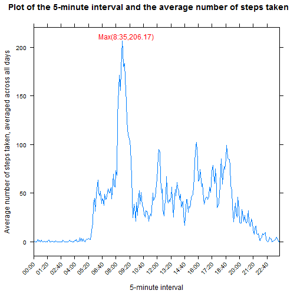
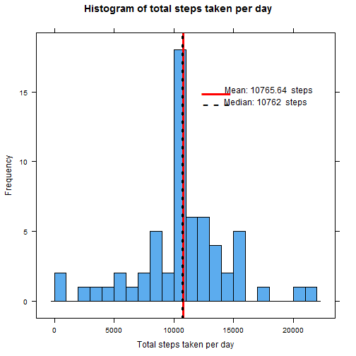
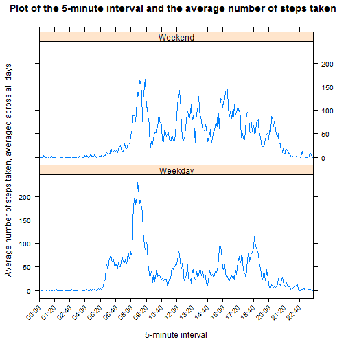

# Reproducible Research: Peer Assessment 1  
## Introduction  
This data analysis uses data from a personal activity monitoring device. Data were collected in two months period of October and Novmeber in 2012 and include the numbers of steps taken in 5 minute intervals each day by anonymous individuals.(1)    
## Loading and preprocessing the data  
This analysis was done with data sample provided and processed by Professor Roger D. Peng for the Reproducible Research course on Coursera.org. Data were downloaded using R Programing Language from the following link [https://d396qusza40orc.cloudfront.net/repdata%2Fdata%2Factivity.zip] on May 8, 2014. Downloaded file which is archive file is unzipped and the final dataset file is comma-separated-value (CSV) file. R packages used in this data analysis are cited in the *Reference* section.(2,3,4,5)

```r
library(reshape2)
library(lattice)
library(Hmisc)
library(stringi)
setInternet2(TRUE)
options(scipen = 999)
```


```r
if (!file.exists("./data")) {
    dir.create("./data")
}
fileUrl <- "https://d396qusza40orc.cloudfront.net/repdata%2Fdata%2Factivity.zip"
download.file(fileUrl, "./Data/Activity.zip")
unzip("./data/Activity.zip", exdir = "./data")
data <- read.csv("./Data/activity.csv")
str(data)
```

```
## 'data.frame':	17568 obs. of  3 variables:
##  $ steps   : int  NA NA NA NA NA NA NA NA NA NA ...
##  $ date    : Factor w/ 61 levels "2012-10-01","2012-10-02",..: 1 1 1 1 1 1 1 1 1 1 ...
##  $ interval: int  0 5 10 15 20 25 30 35 40 45 ...
```

```r
summary(data)
```

```
##      steps               date          interval   
##  Min.   :  0.0   2012-10-01:  288   Min.   :   0  
##  1st Qu.:  0.0   2012-10-02:  288   1st Qu.: 589  
##  Median :  0.0   2012-10-03:  288   Median :1178  
##  Mean   : 37.4   2012-10-04:  288   Mean   :1178  
##  3rd Qu.: 12.0   2012-10-05:  288   3rd Qu.:1766  
##  Max.   :806.0   2012-10-06:  288   Max.   :2355  
##  NA's   :2304    (Other)   :15840
```

```r
data$date <- as.Date(as.character(data$date), "%Y-%m-%d")
datadim <- dim(data)
NAsteps <- sum(is.na(data$steps))
```

This data sample contains 17568 observations, each containing 3 variables:  
- *steps* Number of steps taken in 5 minute interval. Note that there are 2304 missing values (NAs) in this column  
- *date* Date on which the measurement was taken in YYYY-MM-DD format, initially as factor variable converted as Date variable  
- *interval* Integer identifier of the 5 minute interval when steps were recorded   

## What is mean total number of steps taken per day?
For the first part of the assignment using package **reshape2** data were reshaped accordingly (ID variable - date; measure variable - steps), so we can easily do the summation of steps taken per day. Melted data are then recasted into a result dataframe *stepsByDate*. Missing values are ignored, since we were instructed to do so. There are dates where all entries for steps taken in that day are NAs - missing values, for the rest of dates all values of steps are non NA values. For the mean and median of total steps taken per day calculation we exclude dates with NA values.

```r
idVars <- "date"  #define ID variables - date
measures <- "steps"  #define measure variables - steps
melted <- melt(data, idVars, measure.vars = measures)  #melt data for easier summation steps per day
stepsByDate <- dcast(melted, date ~ variable, sum)  #recast data
names(stepsByDate)[2] <- "totalsteps"
head(stepsByDate)
```

```
##         date totalsteps
## 1 2012-10-01         NA
## 2 2012-10-02        126
## 3 2012-10-03      11352
## 4 2012-10-04      12116
## 5 2012-10-05      13294
## 6 2012-10-06      15420
```

```r
meanStepsByDate <- round(mean(stepsByDate$totalsteps, na.rm = TRUE), 2)  #calculate mean of total steps taken per day
medianStepsByDate <- round(median(stepsByDate$totalsteps, na.rm = TRUE), 2)  #calculate median of total steps taken
```

Mean total number of steps taken per day is 10766.19 steps and median total number of steps taken per day is 10765 steps.  
Histogram of total numbers of steps taken each day is plotted using **lattice** package.

```r
histogram(stepsByDate$totalsteps, breaks = 20, col = "steelblue2", main = "Histogram of total steps taken per day", 
    xlab = "Total steps taken per day", ylab = "Frequency", type = "count", 
    panel = function(x, ...) {
        panel.histogram(x, ...)
        panel.abline(v = meanStepsByDate, col = "red", lwd = 3)
        panel.abline(v = medianStepsByDate, col = "black", lwd = 3, lty = 3)
        panel.text(13600, 10.4, "__", col = "red", cex = 3)
        panel.text(13600, 9.4, "- - -", cex = 2)
        panel.text(18000, 10, paste("Mean:", as.character(round(meanStepsByDate, 
            2)), " steps"))
        panel.text(17720, 9.5, paste("Median:", as.character(round(medianStepsByDate, 
            2)), " steps"))
    })
```

 


## What is the average daily activity pattern?
The second question requires reshaping data (ID variable - interval; measure variable - steps), so we can easily find the average of steps taken in 5 minute interval each day. Melted data are then recasted in data frame *stepsByInterval*. 

```r
idVars <- "interval"  #define ID variables - interval
measures <- "steps"  #define measure variables - steps
melted <- melt(data, idVars, measure.vars = measures)  #melt data for easier averaging steps per interval 
stepsByInterval <- dcast(melted, interval ~ variable, mean, na.rm = TRUE)  #recast data
dim(stepsByInterval)
```

```
## [1] 288   2
```

```r
head(stepsByInterval)
```

```
##   interval   steps
## 1        0 1.71698
## 2        5 0.33962
## 3       10 0.13208
## 4       15 0.15094
## 5       20 0.07547
## 6       25 2.09434
```

```r
maxinterval <- stepsByInterval[which.max(stepsByInterval$steps), 1]  #835 (8:35AM) interval has maximum avarage steps taken
maxsteps <- round(stepsByInterval[which.max(stepsByInterval$steps), 2], 2)  #max average steps taken   
# this is the record for max average steps per 5 minute interval each day
stepsByInterval[which.max(stepsByInterval$steps), ]
```

```
##     interval steps
## 104      835 206.2
```

```r
minute <- stri_sub(as.character(maxinterval), -2, -1)
hour <- substr(as.character(maxinterval), 1, nchar(as.character(maxinterval)) - 
    2)
minuteminus5 <- as.numeric(minute) - 5
stepsByInterval$ordinalnumber <- 1:nrow(stepsByInterval)
```

Maximum average steps per interval taken each day 206.17 are taken in the 835 interval  (8:30 - 8:35).  
Time series plot of the 5-minute interval and the average number of steps taken, averaged across all days is constructed in **lattice**. **Note that on the x axis I am plotting the ordinal number of the interval (1-288) and I am acordingly adding time labels to the x axis, to avoid gaps when hour changes.**

```r
# prepare the time labels for x axis
labels <- as.character(stepsByInterval[seq(1, 288, by = 16), 1])
labels <- paste(makeNstr("0", 4 - nchar(labels)), labels, sep = "")
labels = paste(substr(labels, 1, 2), ":", stri_sub(labels, -2, -1), sep = "")
xyplot(steps ~ ordinalnumber, data = stepsByInterval, type = "l", main = "Plot of the 5-minute interval and the average number of steps taken", 
    xlab = "5-minute interval", ylab = "Average number of steps taken, averaged across all days", 
    scales = list(x = list(at = seq(1, 288, by = 16), limits = c(1, 288), labels = labels, 
        rot = 45)), panel = function(x, y, ...) {
        panel.xyplot(x, y, ...)
        panel.text(stepsByInterval[which.max(stepsByInterval$steps), 3] + 5, 
            maxsteps + 5, paste("Max(", paste(substr(as.character(maxinterval), 
                1, 1), ":", stri_sub(as.character(maxinterval), -2, -1), sep = ""), 
                ",", maxsteps, ")", sep = ""), col = "red")
    })
```

 

The plot suggests that approximately till 5:30 in the morning, there is low or no activity. Then it has generally increasing trend and peaks at 8:30 AM, activity significantly drops around 9:30 AM. From 10 AM till 8 PM activity moderately changes going up and down. After 8 PM starts dropping and reaches values close to 0 around 12 AM i.e. midnight. 
## Imputing missing values  
As mentioned before, there are dates where steps value for all recorded intervals are NAs - missing values in the dataset.

```r
rowswithNA <- nrow(data[!complete.cases(data), ])
```

There are 2304 total number of rows with NAs in the dataset. To avoid bias into calculations and summaries of data, missing values for the *steps* variable are substituted with the corresponding mean for that 5-minute interval across all days. New data frame with substituted NA values is *dataNew*.

```r
dataNew <- data
for (i in which(is.na(data[, 1]))) {
    dataNew[i, 1] <- as.integer(round(stepsByInterval[stepsByInterval$interval == 
        dataNew[i, 3], 2], 0))
}
```

The first step of the assignment is repated with new dataframe with substituted NAs.

```r
idVars <- "date"  #define ID variables - date
measures <- "steps"  #define measure variables - steps
melted <- melt(dataNew, idVars, measure.vars = measures)  #melt data for easier sumation steps per day 
stepsByDateNew <- dcast(melted, date ~ variable, sum)  #recast data
names(stepsByDateNew)[2] <- "totalsteps"
head(stepsByDateNew)
```

```
##         date totalsteps
## 1 2012-10-01      10762
## 2 2012-10-02        126
## 3 2012-10-03      11352
## 4 2012-10-04      12116
## 5 2012-10-05      13294
## 6 2012-10-06      15420
```

```r
meanStepsByDateNew <- round(mean(stepsByDateNew$totalsteps, na.rm = TRUE), 2)  #calculate mean of total steps taken per day
medianStepsByDateNew <- round(median(stepsByDateNew$totalsteps, na.rm = TRUE), 
    2)  #calculate median of total steps taken
```

Mean total number of steps taken per day is 10765.64 steps and median total number of steps taken per day is 10762 steps. Comparing the numbers calculated in the first step we come to conclusion that mean of the total steps taken per day doesn't change significantly, it's slightly decreased. There is change in the median of total number of steps taken per day, it's decreased for 3 steps.  
Histogram of total numbers of steps taken each day is plotted with the new dataframe.

```r
histogram(stepsByDateNew$totalsteps, breaks = 20, col = "steelblue2", main = "Histogram of total steps taken per day", 
    xlab = "Total steps taken per day", ylab = "Frequency", type = "count", 
    panel = function(x, ...) {
        panel.histogram(x, ...)
        panel.abline(v = meanStepsByDateNew, col = "red", lwd = 3)
        panel.abline(v = medianStepsByDateNew, col = "black", lwd = 3, lty = 3)
        panel.text(13600, 15.8, "__", col = "red", cex = 3)
        panel.text(13600, 14.2, "- - -", cex = 2)
        panel.text(18020, 15.2, paste("Mean:", as.character(round(meanStepsByDateNew, 
            2)), " steps"))
        panel.text(17740, 14.3, paste("Median:", as.character(round(medianStepsByDateNew, 
            2)), " steps"))
    })
```

 

## Are there differences in activity patterns between weekdays and weekends?
For the purpose of the last part in data analysis, new variable(column) *typeday* is created in the dataframe with substituted NAs, populated with "Weekday" or "Weekend" accordingly and further is converted into factor variable. Then data are reshaped accordingly and average of steps per interval and type of day is calculated. Result is the new dataframe *stepsByInterType*.

```r
# create new variable typeday and populate it with 'Weekend' or 'Weekday';
# convert it to factor
dataNew$typeday <- rep(NA, nrow(dataNew))
dataNew[weekdays(dataNew$date) %in% c("Monday", "Tuesday", "Wednesday", "Thursday", 
    "Friday"), 4] <- "Weekday"
dataNew[weekdays(dataNew$date) %in% c("Saturday", "Sunday"), 4] <- "Weekend"
dataNew$typeday <- as.factor(dataNew$typeday)
idVars <- c("interval", "typeday")  #define ID variables - interval + type day
measures <- "steps"  #define measure variables - steps
melted <- melt(dataNew, id.vars = idVars, measure.vars = measures)  #melt data for easier averaging steps per interval and daytype 
stepsByInterType <- dcast(melted, interval + typeday ~ variable, mean)  #recast data
head(stepsByInterType)
```

```
##   interval typeday  steps
## 1        0 Weekday 2.2889
## 2        0 Weekend 0.2500
## 3        5 Weekday 0.4000
## 4        5 Weekend 0.0000
## 5       10 Weekday 0.1556
## 6       10 Weekend 0.0000
```

Time series plot of the 5-minute interval and the average number of steps taken, averaged across all days for weekends and weekdays(2 panels) is constructed in **lattice**. **Note that on the x axis I am plotting the ordinal number of the interval (1-288) and I am acordingly adding time labels to the x axis, to avoid gaps when hour changes.**

```r
stepsByInterType$ordinalnumber <- rep(NA, nrow(stepsByInterType))
stepsByInterType[stepsByInterType$typeday == "Weekend", 4] <- 1:288
stepsByInterType[stepsByInterType$typeday == "Weekday", 4] <- 1:288
xyplot(steps ~ ordinalnumber | typeday, data = stepsByInterType, type = "l", 
    layout = c(1, 2), main = "Plot of the 5-minute interval and the average number of steps taken", 
    xlab = "5-minute interval", ylab = "Average number of steps taken, averaged across all days", 
    scales = list(x = list(at = seq(1, 288, by = 16), limits = c(1, 288), labels = labels, 
        rot = 45)))
```

 

```r
# exploring the maximum of average steps for weekdays and weekends
wdays <- subset(stepsByInterType, stepsByInterType$typeday == "Weekday")
wends <- subset(stepsByInterType, stepsByInterType$typeday == "Weekend")
# for the weekdays
maxintervalweekday <- wdays[which.max(wdays$steps), 1]  #interval that has maximum avarage steps taken
maxintervalweekday <- paste(substr(maxintervalweekday, 1, 1), ":", stri_sub(maxintervalweekday, 
    -2, -1), sep = "")
maxstepsweekday <- round(as.numeric(wdays[which.max(wdays$steps), 3]), 2)  #max average steps taken
# for weekend
maxintervalweekend <- wends[which.max(wends$steps), 1]  #interval that has maximum avarage steps taken
maxintervalweekend <- paste(substr(maxintervalweekend, 1, 1), ":", stri_sub(maxintervalweekend, 
    -2, -1), sep = "")
maxstepsweekend <- round(as.numeric(wends[which.max(wends$steps), 3]), 2)  #max average steps taken
```

Observing the two plots of average number of steps taken, averaged across all days and the 5 minute interval we come to conclusion that there are some differences in patterns of behavior during the weekdays and weekends. In weekdays activity in the morning increases earlier than in the weekends.  
Maximum average steps taken during the weekdays is 230.36, the peak happens at 8:35 AM, while during the weekend maximum average steps is 166.62 and happens later at 9:15 AM. During the weekends, activity is higher than in the weekdays in the period from 9 AM till 5 PM, averages for the weekend are over 100 steps and for weekdays are under 100 steps. Around 7 PM during the weekdays there is again increased activity, and after that both plots register trend of decreasing activity.

### References
1. Coursera: Reproducible Research By Roger D. Peng . Coursers. *Online* [https://class.coursera.org/repdata-002]
2. Hadley Wickham Package **reshape2**. The Comprehensive R Archive Network. *Online* [http://cran.r-project.org/web/packages/reshape2/index.html]
3. Deepayan Sarkar Package **lattice**. The Comprehensive R Archive Network. *Online* [http://cran.r-project.org/web/packages/lattice/index.html]
4. Deepayan Sarkar Package **Hmisc**. The Comprehensive R Archive Network. *Online* [http://cran.r-project.org/web/packages/Hmisc/index.html]
5. Marek Gagolewski and Bartek Tartanus Package **stringi**. The Comprehensive R Archive Network. *Online* [http://cran.r-project.org/web/packages/stringi/index.html]
